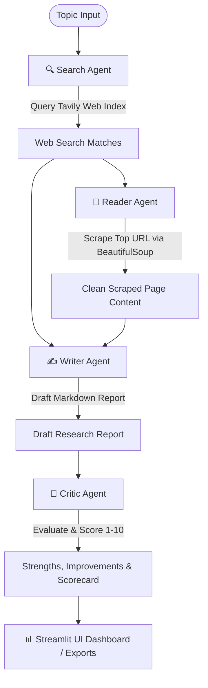

# Multi-Agent AI Research System

An advanced, deep-research pipeline utilizing collaborative AI agents powered by **LangChain** and **Mistral AI** to automate information retrieval, content scraping, professional report generation, and automated critique evaluation.

---

## 🏗️ System Architecture & Workflow

The system implements a sequential multi-agent workflow where specialized agents pass outputs to downstream chains to compile and refine reports:



### The 4 Phases:

1. **Search Agent (Tavily)**: Takes the research topic and queries the web to pull relevant, high-quality search snippets and source URLs.
2. **Reader Agent (BeautifulSoup)**: Analyzes the search matches, selects the most relevant source link, scrapes the raw HTML, and extracts cleaned text content.
3. **Writer Agent (Mistral AI)**: Synthesizes both the broad search logs and deep scraped text to compile a highly structured research report in Markdown.
4. **Critic Agent (Mistral AI)**: Evaluates the finished report, generates a quality score (1-10), logs strengths and areas to improve, and issues a final verdict.

---

## 📁 Project Structure

```text
├── .streamlit/
│   └── config.toml          # Custom slate dark theme styling definitions
├── agents/
│   └── agents.py            # Search & Reader agents setup, Writer & Critic chains
├── pipeline/
│   └── pipeline.py          # Standalone execution pipeline (CLI runner)
├── tools/
│   ├── scraper.py           # BeautifulSoup web scraping tool
│   └── search.py            # Tavily Search API wrapper
├── app.py                   # Main Streamlit UI dashboard
├── requirements.txt         # Project dependencies
└── README.md                # Documentation
```

---

## 🛠️ Setup & Installation

### 1. Prerequisites

Ensure you have Python 3.10+ installed. It is highly recommended to use the `uv` package manager for faster dependency resolution.

### 2. Install Dependencies

Clone the repository and install the dependencies in your virtual environment:

```bash
# Using uv (recommended)
uv pip install -r requirements.txt

# Or using standard pip
pip install -r requirements.txt
```

### 3. Environment Variables

Create a `.env` file in the root directory and add your API keys:

```env
MISTRAL_API_KEY=your_mistral_api_key_here
TAVILY_API_KEY=your_tavily_search_api_key_here
```

---

## 🚀 Running the Application

### Option A: Streamlit UI (Recommended)

Launch the interactive dashboard to run research and inspect visual scorecard tabs, side-by-side agent logs, and download buttons:

```bash
streamlit run app.py
```

Open **`http://localhost:8501`** in your browser.

### Option B: Command Line Interface (CLI)

Run the pipeline directly in your terminal:

```bash
python -m pipeline.pipeline
```

You will be prompted to enter a research topic, and the step logs, draft, and critique will print directly to the console.
